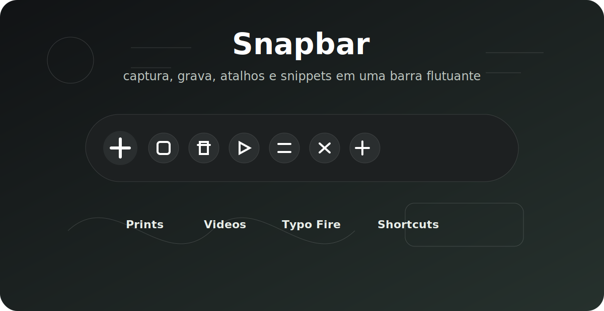
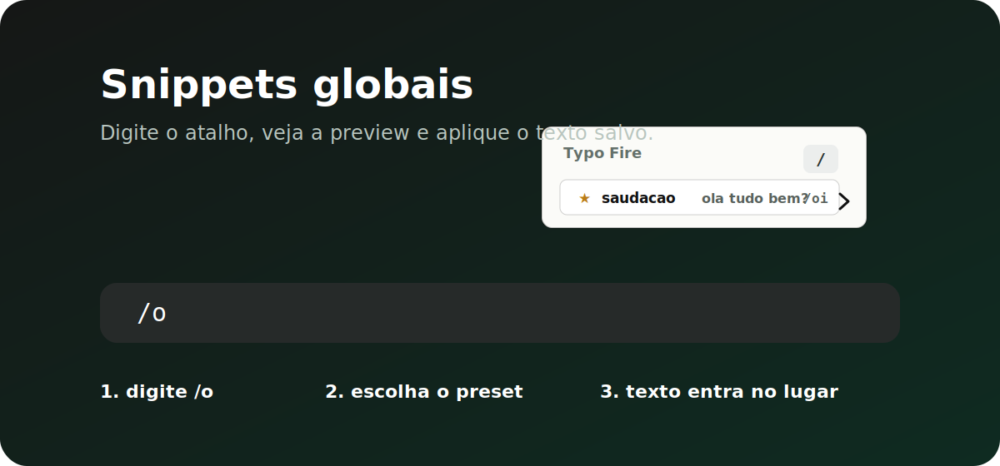
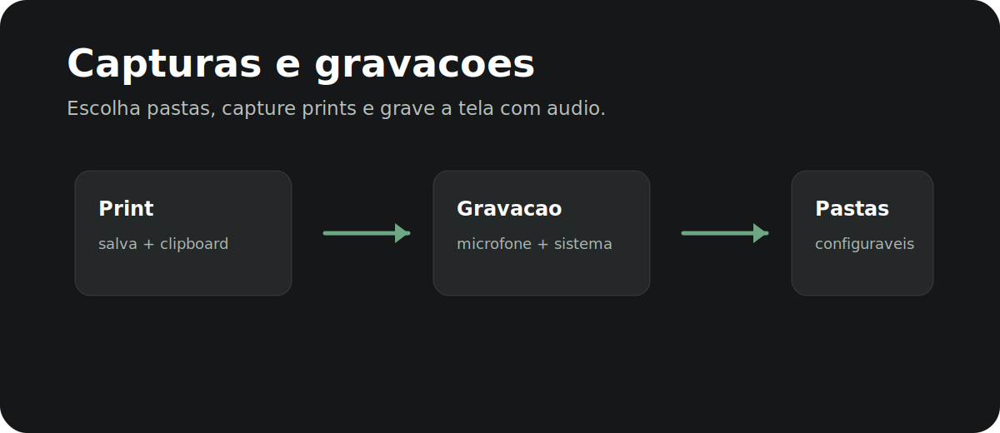

# Snapbar

> Uma barra flutuante open source para capturar, gravar, baixar, acionar atalhos e expandir textos sem sair do fluxo.



<p align="center">
  
  
  
  
</p>

## O que ele faz

| Area | Recursos |
| --- | --- |
| Captura | Prints com recorte nativo do Windows e pasta configuravel |
| Gravacao | Gravacao de tela com audio do sistema e microfone |
| Downloads | Baixa videos e audios de links publicos da Internet com yt-dlp local |
| Digitação por voz | Aciona o Win+H do Windows |
| Typo Fire | Snippets globais no estilo Text Blaze, como `/oi` -> texto salvo |
| Atalhos | Shortcuts globais configuraveis para abrir, capturar e gravar |
| Janela | Toolbar flutuante, sempre no topo, com snap nas bordas |
| Configuracoes | Sidebar com Geral, Typo Fire, Shortcuts, Audio, Arquivos e Sobre |

## Open source e privacidade

Snapbar é um projeto open source e local-first. O uso do app é livre, sem bloqueios remotos ou servidor próprio para validar acesso.

Não há conta, nuvem, sincronização ou telemetria no runtime do Snapbar.

## Typo Fire

Digite um prefixo e escolha um preset sem tirar a mao do teclado.



- Preview global perto do campo de texto
- Favoritos primeiro
- Clique fora fecha a preview
- Presets clicaveis
- Buffer curto em memoria, sem salvar texto digitado

## Capturas e gravacoes



- Escolha onde salvar prints
- Use o recorte nativo do Windows para selecionar a area; o Snapbar salva o PNG automaticamente na pasta configurada
- Escolha onde salvar videos
- Grave com microfone, audio do sistema ou ambos
- Cole links publicos na janela de Downloads e escolha MP4, MP3, qualidade de video ou bitrate de audio
- Acesse tudo pela barra ou por atalho global

## Downloads da Internet

- Usa `yt-dlp` local para analisar e baixar links publicos de sites suportados
- Usa `deno` local embutido como runtime JS controlado para o `yt-dlp` decodificar players quando necessario
- Usa `ffmpeg`/`ffprobe` locais para mesclar ou converter saidas quando necessario
- Salva por padrao em `Downloads` do Windows, com opcao de escolher outra pasta
- Nao le cookies do navegador e nao salva historico permanente de links
- Mostra progresso, velocidade e aviso curto `Salvo em: ...` ao concluir
- Usa suporte a NVENC via FFmpeg internamente quando disponivel, sem exigir configuracao do usuario

## Digitação por voz

- Clique no microfone da toolbar ou use o atalho global de **Digitação por voz**
- O Snapbar tenta devolver foco para o ultimo app externo e envia **Win+H**
- O segundo clique faz o toggle normal da Digitação por voz do Windows
- Nao ha motor local, modelo Whisper, sidecar, pacote offline, historico de audio ou audio temporario do Snapbar
- Quando o Win+H falhar, a mensagem simples e **Ditado do Windows nao abriu**

## Assets do pacote Tauri

### Ícone do aplicativo

`src-tauri/icons/icon-source-full.png` é a fonte canônica do ícone da mão. Ela usa um canvas quadrado totalmente opaco, sem padding transparente ou bordas adicionais. Os ícones de plataforma em `src-tauri/icons/` são gerados a partir dela e devem ser mantidos no instalador.

Para regenerá-los após uma atualização intencional do ícone:

```bash
npx tauri icon src-tauri/icons/icon-source-full.png --output src-tauri/icons
```

Assets esperados no pacote:

```text
src-tauri/resources/bin/ffmpeg.exe
src-tauri/resources/bin/ffprobe.exe
src-tauri/resources/bin/yt-dlp.exe
src-tauri/resources/bin/deno.exe
src-tauri/runtime-assets.json
```

Esses binarios grandes nao sao versionados no Git. O usuario final nao baixa nada separadamente: o instalador principal deve ser gerado com esses assets ja embutidos. O build de instalador executa `npm run assets:prepare` automaticamente antes de compilar o frontend e empacotar o Tauri.

Para preparar manualmente um clone local, uma maquina de build ou validar os assets antes do empacotamento, rode:

```bash
npm run assets:prepare
```

O comando baixa FFmpeg/FFprobe, yt-dlp e Deno, copia tudo para `src-tauri/resources` e valida os checksums do manifest. Isso deixa o repositorio leve para GitHub e ainda torna o build reproduzivel para outros devs.

`ffmpeg.exe` tambem e usado para gravacao de tela, deteccao de microfone e downloads da Internet. `yt-dlp.exe`, `deno.exe` e `ffprobe.exe` sao assets obrigatorios para Downloads. O usuario final nao instala nada manualmente: esses assets entram no instalador. Em desenvolvimento debug, `SNAPBAR_FFMPEG_PATH` e `SNAPBAR_YT_DLP_PATH` podem apontar para binarios locais, mas release valida apenas assets empacotados.

Antes de um build de release, o manifest `src-tauri/runtime-assets.json` deve conter versao, origem, licenca de origem e SHA-256 real de cada asset. `cargo build --release`/`tauri build` falha quando um asset obrigatorio esta ausente, corrompido ou com checksum ainda nao preenchido.

Privacidade padrao: o Snapbar nao captura audio para Digitação por voz. O audio do ditado e tratado pelo recurso nativo do Windows.

## Stack

- Tauri 2
- React 19
- TypeScript
- Rust
- Vite
- Vitest
- lucide-react

## Rodando localmente

```bash
npm install
npm run assets:prepare
npm run tauri dev
```

## Colaboradores e testers

Para desenvolver no Windows x64:

```bash
git clone <repo>
cd <repo>
npm install
npm run assets:prepare
npm run tauri dev
```

Para testers nao tecnicos, publique o instalador pronto como release. Eles devem baixar o `.exe` ou `.msi` pronto, nao clonar o repositorio nem instalar dependencias de desenvolvimento.

Arquivos grandes como `ffmpeg.exe`, `ffprobe.exe`, `yt-dlp.exe` e `deno.exe` ficam fora dos commits comuns. O GitHub bloqueia arquivos grandes em repositorios Git, entao o fluxo correto e: codigo no repo, assets grandes baixados por script/CI, instalador final publicado como release.

## Validacao

```bash
npm run test
npm run build
npm run site:build
cargo test --manifest-path src-tauri/Cargo.toml
npm run assets:verify
```

Para validar release consumer-ready no Windows x64, garanta que o manifest tenha checksums reais e rode:

```bash
npm run package
```

Durante esse build, `npm run assets:prepare` roda automaticamente, `npm run assets:verify` roda antes do bundler do Tauri e `npm run assets:verify-package` confere a pasta final usada pelo pacote. O instalador resultante deve incluir FFmpeg e os assets obrigatorios de downloads. Nao publique um instalador que exija que o usuario final baixe esses arquivos manualmente.

## Roadmap curto

- Stickers flutuantes para notas
- Busca visual de presets do Typo Fire
- Historico rapido de prints e videos
- Mais acoes na barra
